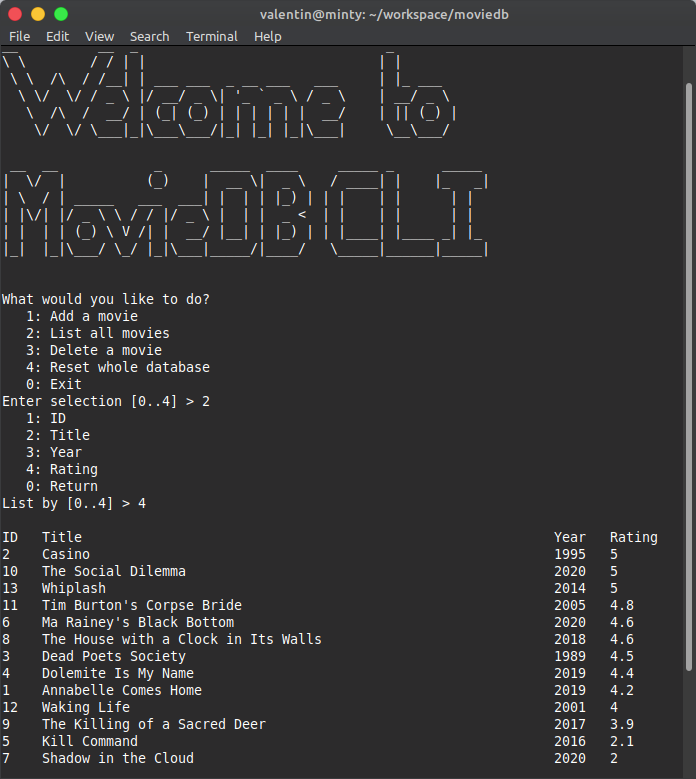

# :movie_camera: MovieDB
Simple CLI tool for movie database management.

# :bulb: Key Features
- Add movies
- List movies (ORDER BY)
- Delete movies

# :art: UI Example

# :hammer: Building the Application
+ download the source code `git clone https://github.com/soundwalk/moviedb.git`
+ go to the main folder `cd ./moviedb/`
+ generate Makefile `cmake ./CMakeLists.txt`
+ build the App `make`
+ run the App via `./moviedb`

# Motivation
I made this application just to try to show as many things as possible that I learned throughout my first year of college. Some of the highlights of this application include:
### Object-Oriented Programming
+ class, object
+ encapsulation
+ abstraction
+ associations (nested classes, aggregation)
+ access modifiers
### Files
+ working with directories and files
+ I/O permissions
+ file RW pointers
+ Master file
+ sorted Index files for each column/attribute
### STL
+ generic programming (templates)
+ array
+ cstring
+ limits
### C++ stuff
+ pointers (alias, reference)
+ libraries
+ headers, sources
+ memory management
+ try-catch
+ exceptions
+ ternary operator
+ lambda functions